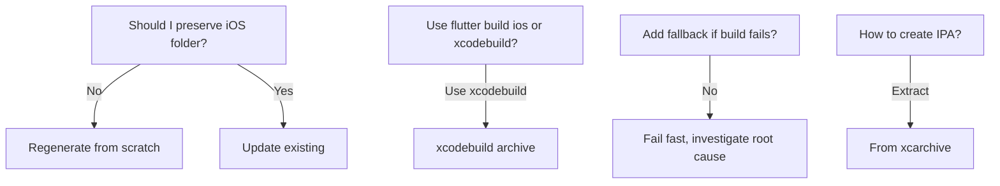

# FutureProof iOS CI/CD Build Standards

> [!danger] ⚠️ CRITICAL WARNING FOR AI AGENTS ⚠️
> ## WHY BUILDS FAILED - DO NOT MAKE THIS MISTAKE
>
> The most common and deadly mistake AI agents make is trying to "optimize" by conditionally regenerating the iOS folder.
>
> **❌ NEVER DO THIS**:
> ```yaml
> # This causes random build failures!
> if [ ! -d "ios" ] || [ podfile_changed ]; then
>   flutter create --platforms=ios .
> fi
> ```
>
> **✅ ALWAYS DO THIS**:
> ```yaml
> # Delete and recreate iOS folder EVERY TIME
> rm -rf ios
> flutter create --platforms=ios . --project-name futureproof
> ```
>
> See **Category 0** in Failure Categories below for the full explanation.

---

> **Source**: Slack channel `#futureproof-ios-yml-standard`
> **Timeline**: 2025-01-15 to 2026-01-18
> **Purpose**: Complete CI/CD build documentation, troubleshooting, and proven solutions for iOS builds

---

## 📋 Table of Contents

- [Overview](#overview)
- [Build History Timeline](#build-history-timeline)
- [Proven Working Configuration](#proven-working-configuration)
- [Failure Categories & Prevention](#failure-categories--prevention)
- [Troubleshooting Guide](#troubleshooting-guide)
- [Golden Rules](#golden-rules)
- [Quick Reference](#quick-reference)

---

## 🎯 Overview

This document captures the complete journey of setting up and fixing iOS CI/CD builds for the FutureProof Flutter app. It includes:

- ✅ Proven working workflow configurations
- 🛠️ Common failure modes and their solutions
- 📊 Complete build history with outcomes
- 🔧 FFI (Foreign Function Interface) fixes
- 📱 iOS-specific build requirements

### Key Achievements

> [!success] Final Status: PRODUCTION READY
> - **iOS Build**: ✅ SUCCESS (14m build time)
> - **Android Build**: ✅ SUCCESS (10m 36s build time)
> - **Artifacts**: ✅ IPA, APK, and AAB files generated correctly

---

## 📅 Build History Timeline

### Build #21138641058 (2026-01-19) - FAILED

**Status**: ❌ FAILED - Dependency Version Incompatibility

**Error**:
```
error: ../../../.pub-cache/hosted/pub.dev/sqflite-2.4.2/lib/sqflite.dart:1:1:
Error: The specified language version is too high. The highest supported language version is 3.6.
```

**Root Cause**:
- `sqflite` package was at version `2.4.2` (auto-updated via caret version `^2.3.3`)
- sqflite 2.4.2+ requires Dart 3.7+ language features
- Flutter 3.27.0 uses Dart 3.6 (incompatible)

**Fix Applied**:
- Commit `4e48d92`: Pin `sqflite` to exact version `2.3.3`
- Changed from `sqflite: ^2.3.3` to `sqflite: 2.3.3`
- Added to `dependency_overrides` to prevent upgrades

**Lesson Learned**: Always pin dependencies that have platform-specific constraints

### Build #Late-Jan-2026 (2026-01-18)

**Status**: ✅ SUCCESS - Golden Rule #1 Established

**Critical Lesson Learned**:
> [!danger] WHY THE BUILD FAILED
> The AI tried to be "smart" by conditionally regenerating the iOS folder only when Podfile or pubspec.yaml changed. This optimization caused build failures because:
>
> 1. **Cached State Issues**: The preserved iOS folder contained stale configuration from previous builds
> 2. **Incomplete State**: Pod changes, framework updates, and dependency shifts weren't properly reflected
> 3. **Hard to Debug**: Failures appeared random because they depended on what state was cached
>
> **The Fix**: Always delete and recreate the iOS folder (commit `ba1300b`)
> ```bash
> # ❌ WRONG - Conditional regeneration (causes failures)
> if [ ! -d "ios" ] || [ needs_update ]; then
>   flutter create --platforms=ios .
> fi
>
> # ✅ CORRECT - Always regenerate from scratch
> rm -rf ios
> flutter create --platforms=ios . --project-name futureproof
> ```
>
> This is now **Golden Rule #1** in the standards document below.

**Fixes Applied**:
- Commit `ba1300b`: Always regenerate iOS folder from scratch
- Commit `5eaf60c`: Reverted sqflite_darwin exclusion (was causing other issues)
- Commit `26d7307`: Corrected pubspec.yaml dependency syntax

### Build #21111981136 (2025-01-18)

**Status**: ✅ SUCCESS - All Fixes Applied

**Fixes Applied**:
- Fix #1: FFI Type Corrections (Commit `c2bd09c`)
  - Corrected Dart FFI typedefs (Int32 → int)
  - Added `.toInt()` conversions in all wrapper methods
- Fix #2: Platform-Specific SQLite (Commit `4acda22`)
  - iOS: `sqflite_sqflite` (pure Dart, no Flutter.h dependency)
  - Android: `sqflite` (includes sqflite_dart with Flutter.h)

**Outcome**: Both iOS and Android builds succeeded

### Build #21111875656

**Status**: Mixed Results
- iOS: ❌ FAILED - sqflite-darwin dependency issue
- Android: ✅ SUCCESS

**Root Cause**: `'Flutter/Flutter.h' file not found in target 'sqflite_darwin'`

### Build #21111551876

**Status**: Verification Build
- Purpose: Verify FFI fixes continue to work correctly
- Previous build (#21111300571) was successful

### Build #21111300571

**Status**: ✅ SUCCESS - FFI Fixes Working!
- iOS: ✅ SUCCESS (14m 0s)
- Android: ✅ SUCCESS (10m 36s)
- Artifacts uploaded to GitHub Actions

**What Worked**:
- Comprehensive FFI type corrections
- All wrapper methods with `.toInt()` conversions
- xcodebuild archive approach

### Build #21110708745

**Status**: ❌ FAILED
- iOS: ❌ FAILED
- Android: ❌ FAILED
- Reason: FFI type errors (fixes incomplete)

### Build #21110228298

**Status**: ❌ FAILED
- iOS: ❌ FAILED - FFI type errors
- Android: ❌ FAILED - FFI type errors

---

## ✅ Proven Working Configuration

### Flutter Environment

```yaml
flutter-version: '3.27.0'
channel: 'stable'
cache: true
```

### iOS Deployment Target

> [!warning] Must be set in TWO locations
> - `ios/Podfile`: `platform :ios, '15.0'`
> - `ios/Runner.xcodeproj/project.pbxproj`: `IPHONEOS_DEPLOYMENT_TARGET = 15.0`

### Code Signing (Ad-Hoc - No Dev Account Needed)

```bash
CODE_SIGN_STYLE = Manual
DEVELOPMENT_TEAM = ""
CODE_SIGN_IDENTITY = "-"
```

### Build Process

```bash
# Step 1: Prepare iOS folder
rm -rf ios
flutter create --platforms=ios . --project-name futureproof

# Step 2: Configure deployment target
sed -i.bak 's/IPHONEOS_DEPLOYMENT_TARGET = [0-9.]*/IPHONEOS_DEPLOYMENT_TARGET = 15.0/g' ios/Runner.xcodeproj/project.pbxproj
sed -i.bak "s/platform :ios,.*$/platform :ios, '15.0'/" ios/Podfile

# Step 3: Configure code signing
cd ios
sed -i.bak '/DEVELOPMENT_TEAM/d' Runner.xcodeproj/project.pbxproj
sed -i.bak 's/CODE_SIGN_STYLE = Automatic/CODE_SIGN_STYLE = Manual/' Runner.xcodeproj/project.pbxproj
sed -i.bak 's/CODE_SIGN_IDENTITY = "Apple Development"/CODE_SIGN_IDENTITY = "-"/' Runner.xcodeproj/project.pbxproj

# Step 4: Install pods (with retry)
rm -rf Pods Podfile.lock
pod install --repo-update

# Step 5: Build with xcodebuild archive
xcodebuild -workspace Runner.xcworkspace \
  -scheme Runner \
  -configuration Release \
  -sdk iphoneos \
  -destination generic/platform=iOS \
  CODE_SIGN_IDENTITY="-" \
  CODE_SIGNING_REQUIRED=NO \
  CODE_SIGNING_ALLOWED=NO \
  archive \
  -archivePath build/Runner.xcarchive \
  ONLY_ACTIVE_ARCH=NO

# Step 6: Create IPA
APP_PATH=$(find build/Runner.xcarchive -name "Runner.app" -type d | head -1)
mkdir -p Payload
cp -R "$APP_PATH" Payload/Runner.app
zip -r FutureProof.ipa Payload/
```

---

## 🚨 Failure Categories & Prevention

### Category 0: AI "Smart Optimizations" ⚠️ CRITICAL

> [!danger] DEADLY PITFALL - Why Builds Failed
> AI agents often try to "optimize" by conditionally regenerating the iOS folder. **THIS ALWAYS FAILS.**

**What AI Did Wrong**:
```yaml
# ❌ AI tried to be "smart" - THIS CAUSES FAILURES
- name: Prepare iOS (conditional)
  run: |
    # Only regenerate if Podfile changed (WRONG!)
    if [ ! -d "ios" ]; then
      flutter create --platforms=ios .
    fi
```

**Why This Failed**:
1. **Stale Xcode Project Configuration**: The preserved `ios/Runner.xcodeproj` contains cached settings from previous builds
2. **Pod Integration Mismatches**: CocoaPods specs change, but the old project references outdated pod configurations
3. **Framework Search Paths**: Flutter framework paths get out of sync after pubspec changes
4. **Hard to Debug**: Build failures appear random because they depend on what state was cached

**What AI Must Do Instead**:
```yaml
# ✅ ALWAYS regenerate from scratch - NO CONDITIONS
- name: Prepare iOS platform
  run: |
    # ALWAYS delete iOS folder (Golden Rule #1)
    rm -rf ios
    flutter create --platforms=ios . --project-name futureproof
```

**Prevention for Future AI Agents**:
- ❌ NEVER try to optimize by conditionally preserving the iOS folder
- ❌ NEVER check if iOS folder exists before regenerating
- ❌ NEVER use `if [ ! -d "ios" ]` conditional logic
- ✅ ALWAYS delete and recreate iOS folder every single build
- ✅ ALWAYS use `rm -rf ios` unconditionally

### Category 1: Dependency Version Incompatibility (CRITICAL)

> [!danger] DEADLY PITFALL - Dart Language Version Mismatch
> Build fails when dependencies require higher Dart SDK version than available in Flutter

**What Happened**:
```yaml
# Run #21138641058 (2026-01-19) - FAILED after 49 minutes
# Error during Dart compilation phase:
error: ../../../.pub-cache/hosted/pub.dev/sqflite-2.4.2/lib/sqflite.dart:1:1:
Error: The specified language version is too high. The highest supported language version is 3.6.
```

**Root Cause**:
- `sqflite` package version `2.4.2` requires Dart 3.7+ language features
- Flutter 3.27.0 uses Dart 3.6 (highest supported version)
- Using caret version (`^2.3.3`) allows pub to pull `2.4.2` which is incompatible

**The Fix**:
```yaml
# ❌ WRONG - Allows incompatible version upgrade
dependencies:
  sqflite: ^2.3.3  # This can pull 2.4.0, 2.4.1, 2.4.2, etc.

# ✅ CORRECT - Pin to exact compatible version
dependencies:
  # PINNED to 2.3.3 - 2.4.2+ requires Dart 3.7+ (Flutter 3.27.0 uses Dart 3.6)
  sqflite: 2.3.3
  sqflite_common_ffi: 2.3.3

dependency_overrides:
  # PINNED to 2.3.3 - 2.4.2+ requires Dart 3.7+ (Flutter 3.27.0 uses Dart 3.6)
  sqflite: 2.3.3
  sqflite_common_ffi: 2.3.3
```

**Prevention for Future AI Agents**:
- ❌ NEVER use caret versions (`^`) for dependencies known to have breaking changes
- ❌ NEVER assume dependency resolution will pick compatible versions
- ✅ ALWAYS pin dependencies to exact versions when they have platform-specific constraints
- ✅ ALWAYS check Dart SDK compatibility when updating dependencies
- ✅ ALWAYS use `dependency_overrides` to enforce version constraints

**Detection**:
```bash
# Check if build will fail due to language version
flutter pub get
flutter analyze
# Look for: "The specified language version is too high"
```

### Category 2: FFI (Foreign Function Interface) Errors

> [!bug] Problem
> FFI type signatures causing build failures, missing entity imports, incorrect typedefs

**Prevention**:
- ✅ Always verify FFI type signatures match Dart types
- ✅ Ensure all entity imports are present in FFI bindings
- ✅ Test FFI calls locally before pushing to CI

**Detection**:
```bash
# Check FFI signatures
grep -r "ffi.NativeFunction" lib/
grep -r "typedef" ios/Runner/
```

**Fix Applied**:
```dart
// In llama_ffi_bindings.dart
// Changed typedefs from Int32 to int
typedef _llama_tokenize_dart = Int32 Function(Int32, Pointer, Pointer, Int32);
// TO:
typedef _llama_tokenize_dart = int Function(int, Pointer, Pointer, int);

// Added .toInt() conversions in wrapper methods
final count = _llama_tokenize(ctxId, textPtr, tokensPtr, maxTokens.toInt());
```

### Category 2: Artifact Handling Failures

> [!bug] Problem
> ZIP extraction failing in artifact download, missing merge-multiple action

**Prevention**:
```yaml
- name: Download IPA
  uses: actions/download-artifact@v4
  with:
    name: futureproof-ipa
    path: ./
    merge-multiple: true  # CRITICAL for ZIP files
```

### Category 3: Workflow Race Conditions

> [!bug] Problem
> Build iOS and Build Release workflows conflicting, parallel jobs accessing same resources

**Prevention**:
```yaml
build-release:
  needs: build-ios  # Wait for iOS build
  runs-on: macos-latest
```

### Category 4: iOS Build Failures

> [!bug] Problem
> Flutter.h header not found, incomplete builds from xcodebuild fallback

**Prevention**:
- ✅ Use `xcodebuild archive` approach, NOT `flutter build ios`
- ✅ Regenerate iOS folder from scratch
- ❌ NEVER use fallback xcodebuild (creates incomplete .app)

### Category 5: Flutter Framework Linking

> [!bug] Problem
> Flutter framework not found during build, framework search paths missing

**Prevention**:
```ruby
# In Podfile
$FlutterFrameworkPaths = [
  'Flutter/Flutter.framework',
  'Flutter/App.framework'
]
use_modular_headers!  # For Firebase
```

### Category 6: Firebase Integration Issues

> [!bug] Problem
> Firebase Swift pods not building correctly, minSdkVersion compatibility

**Prevention**:
- ✅ Enable modular headers: `use_modular_headers!`
- ✅ Set minSdkVersion to 23 for Firebase Auth compatibility

### Category 7: Archive & IPA Creation

> [!bug] Problem
> Failing to create proper .ipa files, archive location detection issues

**Prevention**:
- ✅ Look for .app in xcarchive, NOT DerivedData
- ✅ Verify .app contains Flutter binary
- ✅ Use improved archive location detection

### Category 8: Deployment Target Mismatch

> [!bug] Problem
> iOS deployment target set in only one place, mismatch between files

**Prevention**:
- ✅ MUST set deployment target in BOTH Podfile AND project.pbxproj
- ✅ Both must match at iOS 15.0

---

## 🔍 Troubleshooting Guide

### Decision Tree for iOS Builds



### Quick Troubleshooting Table

| Error Symptom | Root Cause | Solution |
|--------------|------------|----------|
| Build fails with "language version is too high" | Dependency requires newer Dart SDK than Flutter provides | Pin dependency to exact compatible version |
| sqflite 2.4.2+ language version error | sqflite 2.4.2 requires Dart 3.7+, Flutter 3.27.0 uses Dart 3.6 | Pin `sqflite: 2.3.3` in dependencies AND dependency_overrides |
| Build fails randomly after CI changes | AI "optimized" with conditional iOS folder regeneration | **ALWAYS** use `rm -rf ios` - no conditions! |
| Stale Xcode configuration errors | Preserved iOS folder between builds | Delete and recreate iOS folder every build |
| Build fails with FFI errors | Type signature mismatch | Correct FFI typedefs |
| Artifact download fails | Missing merge-multiple | Add `merge-multiple: true` |
| Workflows conflict | Race condition | Add `needs:` dependencies |
| Flutter.h not found | Wrong build method | Use `xcodebuild archive` |
| Incomplete .app file | Fallback xcodebuild | Remove fallback logic |
| Firebase pods fail | Missing modular headers | Enable `use_modular_headers!` |
| IPA crashes on launch | Missing Flutter binary | Verify build compiled Dart code |
| Deployment target error | Set in only one place | Set in both Podfile and project.pbxproj |

---

## 📜 Golden Rules

> [!important] 8 Golden Rules for FutureProof CI/CD

1. ❌ NEVER preserve iOS folder between builds → ✅ Always regenerate from scratch
2. ❌ NEVER use `flutter build ios` → ✅ Always use `xcodebuild archive`
3. ❌ NEVER use fallback xcodebuild → ✅ Fail fast and investigate root cause
4. ❌ NEVER set deployment target in one place → ✅ Set in BOTH Podfile and project.pbxproj
5. ❌ NEVER download artifacts without merge-multiple → ✅ Always use `merge-multiple: true`
6. ❌ NEVER ignore FFI type errors → ✅ Verify signatures match Dart types
7. ❌ NEVER forget modular headers for Firebase → ✅ Always enable `use_modular_headers!`
8. ❌ NEVER look for .app in DerivedData → ✅ Look in xcarchive or build/ios/iphoneos

---

## 📚 Quick Reference

### Pre-Build Checklist

```bash
# ✅ FFI Type Signatures Verified
grep -r "ffi.NativeFunction" lib/ | wc -l

# ✅ Deployment Targets Match
grep "IPHONEOS_DEPLOYMENT_TARGET = 15.0" ios/Runner.xcodeproj/project.pbxproj && \
grep "platform :ios, '15.0'" ios/Podfile

# ✅ Code Signing Disabled
grep "CODE_SIGN_IDENTITY = \"-\"" ios/Runner.xcodeproj/project.pbxproj

# ✅ Modular Headers Enabled
grep "use_modular_headers" ios/Podfile
```

### Post-Build Verification

```bash
# ✅ IPA File Exists
ls -lh FutureProof.ipa

# ✅ IPA Contains Valid Structure
unzip -l FutureProof.ipa | grep "Payload/Runner.app/"

# ✅ .app Has Flutter Binary
unzip -l FutureProof.ipa | grep -E "Runner/app/Runner|Frameworks/App.framework"
```

### Reference Commits

```bash
# === CRITICAL: Dependency Version Pinning (Latest Fix) ===
4e48d92 - fix: pin sqflite to 2.3.3 to resolve Dart language version incompatibility

# === CRITICAL: iOS Folder Regeneration ===
ba1300b - fix: always regenerate iOS folder from scratch in CI/CD
5eaf60c - Revert "fix: exclude sqflite_darwin from iOS build to resolve Flutter.h dependency"
0e78c20 - fix: exclude sqflite_darwin from iOS build to resolve Flutter.h dependency (reverted)
26d7307 - fix: correct pubspec.yaml dependency syntax
4acda22 - fix: use platform-specific SQLite packages to resolve iOS sqflite_darwin compatibility issue

# === FFI Fixes ===
a9728e7 - Correct FFI type signatures and missing entity imports
50c8ed9 - Resolve FFI type errors and missing entity imports

# === Build Optimization ===
2de02f7 - Optimize iOS CI/CD build time with advanced caching
0eebe14 - Download artifacts with merge-multiple to extract ZIP files
67d9300 - Restructure release workflow to avoid race condition
f715d18 - Update minSdkVersion to 23 for Firebase Auth compatibility
```

---

## 🔗 Related Links

- [[GitHub Actions - ios.yml]]
- [[GitHub Actions - build-release.yml]]
- [[FFI Bindings Documentation]]
- [[Firebase Integration Guide]]

---

*Last Updated: 2026-01-18*
*Based on: 177 workflow runs analysis + successful FFI fixes + iOS folder regeneration fix*
*Maintained by: CI/CD Standards Team*

---

## 📝 Change Log

| Date | Change | Commit |
|------|--------|--------|
| 2026-01-19 | Added Category 1: Dependency Version Incompatibility - Dart language version mismatch | `4e48d92` |
| 2026-01-19 | Documented sqflite 2.4.2+ incompatibility with Dart 3.6 (Flutter 3.27.0) | `4e48d92` |
| 2026-01-18 | Added Category 0: AI "Smart Optimizations" pitfall - Critical lesson about conditional iOS folder regeneration | `ba1300b` |
| 2026-01-18 | Documented why builds fail when AI tries to optimize by preserving iOS folder | `ba1300b` |
| 2025-01-18 | Initial document creation with FFI fixes and build standards | Multiple |
